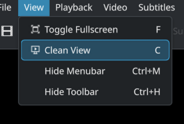

<!--
SPDX-FileCopyrightText: 2020 George Florea Bănuș <georgefb899@gmail.com>

SPDX-License-Identifier: CC-BY-4.0
-->

### [Read before reporting a bug or requesting a feature](./bugs_and_feature_requests.md)

----

#### Donate: [GitHub Sponsors](https://github.com/sponsors/g-fb) | [Liberapay](https://liberapay.com/gfb/) | [PayPal](https://paypal.me/georgefloreabanus)

# Haruna (Clean View Fork)

Haruna is an open source media player built with Qt/QML and libmpv.


For more screnshots go to [Haruna's website](https://haruna.kde.org)

# Install

https://flathub.org/apps/details/org.kde.haruna

```
flatpak install flathub org.kde.haruna
flatpak run org.kde.haruna
```

[Flatpak setup guide](https://flatpak.org/setup/)

# Features

these are just some features that set Haruna apart from others players

- video preview on seek/progress bar

- play online videos, through youtube-dl

- toggle playlist with mouse-over, playlist overlays the video

- auto skip chapter containing certain words

- configurable shortcuts and mouse buttons

- quick jump to next chapter by middle click on progress bar

- custom mpv commands, can be run at start up or on keyboard shortcut

# Clean View (CUI) Build

This repository contains a custom build of Haruna that adds a **Clean View** mode — a borderless, chrome-free window that makes it easy to arrange multiple video instances side by side in custom layouts, without fullscreen locking each one to a single display.



## What is Clean View?

Clean View hides the menu bar, toolbar, and playback controls while keeping the window freely resizable and repositionable. This makes it ideal for multi-video setups: open several Haruna windows, press `C` in each, and arrange them across your desktop however you like — stacked, side by side, picture-in-picture, etc. Each window remains independently controllable.

When in Clean View:

- All chrome (menu bar, toolbar, playback footer) is hidden
- The window native title bar is removed
- A minimal title bar fades in when the mouse hovers over the top edge — showing the window title and minimize/maximize/close buttons, with drag-to-move support
- Resize handles are active at all window edges and corners
- Right-clicking the video brings up a context menu with a **Clean View / Exit Clean View** toggle at the top
- The playback footer peeks up when the mouse moves to the bottom of the window (same behavior as fullscreen mode)
- The keyboard shortcut `C` toggles Clean View on/off
- Clean View is also accessible from the **View** menu

## Building the CUI build

### Dependencies

All standard Haruna dependencies are required. On Arch/CachyOS:

```bash
sudo pacman -S cmake ninja extra-cmake-modules qt6-base qt6-declarative \
    qt6-5compat qt6-shadertools kirigami kconfig kcoreaddons ki18n kio \
    kiconthemes kcolorscheme kwindowsystem kcrash kfilemetadata \
    kwindowsystem mpvqt ffmpeg breeze-icons kdsingleapplication
```

Any missing dependencies will be reported by `cmake` during configuration.

### Build and install

```bash
git clone https://github.com/danielburgess/haruna-cui.git
cd haruna

# Uninstall any existing system package first
sudo pacman -R haruna

# Configure, build, and install
cmake -B build -G Ninja
cmake --build build -j$(nproc)
sudo cmake --install build
```

The binary installs to `/usr/bin/haruna` and integrates normally with your desktop environment (app launcher, file associations, etc.).

### Rebuilding after changes

```bash
cmake --build build -j$(nproc)
sudo cmake --install build
```

# Dependencies
Dependencies will be printed by `cmake` when building.

# Build (upstream)

```bash
git clone https://invent.kde.org/multimedia/haruna.git
cd haruna
cmake -B build -G Ninja
cmake --build build
cmake --install build
```
